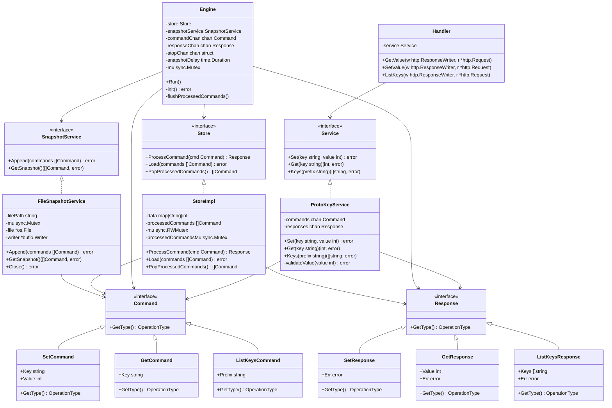
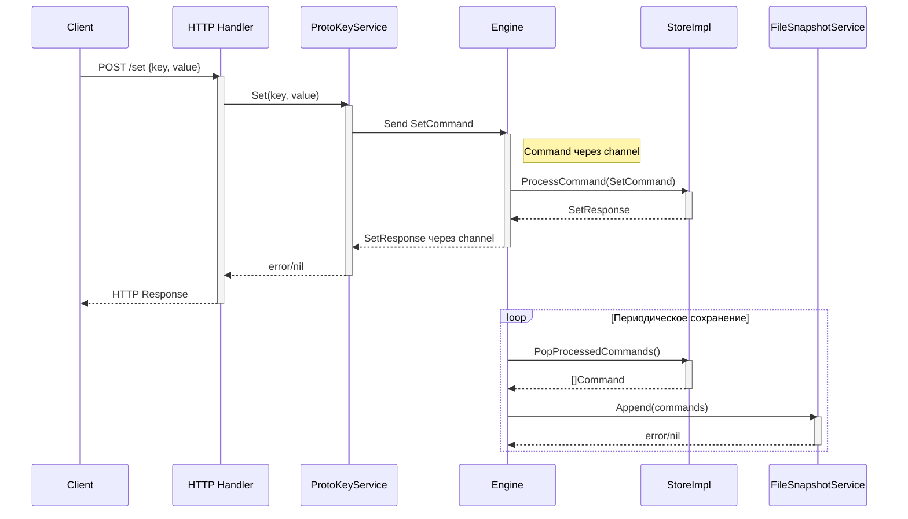

# ProtoKey

****

## Расположение

**protokey**
``
./protokey/protokey
``

**protocli**
``
./protokey/protocli
``

## Структура проекта protokey




## Сценарий обработки set



## Пример работы protocli + protokey

**Получение help protocli**
```
MBP-Maksim:protocli maksimveselov$ ./main 
A command line client for interacting with the Protokey key-value store

Usage:
  protocli [command]

Available Commands:
  completion  Generate the autocompletion script for the specified shell
  get         Get a value by key
  help        Help about any command
  keys        Get keys matching prefix
  set         Set a key-value pair

Flags:
  -h, --help   help for protocli

Use "protocli [command] --help" for more information about a command.
```

**Невалидная команда protocli**
```
MBP-Maksim:protocli maksimveselov$ ./main sq
Error: unknown command "sq" for "protocli"

Did you mean this?
        set

Run 'protocli --help' for usage.
unknown command "sq" for "protocli"

Did you mean this?
        set

MBP-Maksim:protocli maksimveselov$ 
```

**Set через protocli**
```
MBP-Maksim:protocli maksimveselov$ ./main set key 10
OK
```

**Set через protocli с невалидным значением**
```
MBP-Maksim:protocli maksimveselov$ ./main set key 123123123123123123
Error (400): bad request
```

**Get через protocli**
```
MBP-Maksim:protocli maksimveselov$ ./main get key
10
```

**Keys через protocli**
```
MBP-Maksim:protocli maksimveselov$ ./main keys k
key1
key
```